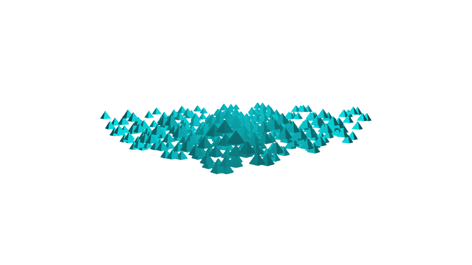

# GeometryTypes

[](https://travis-ci.org/JuliaGeometry/GeometryTypes.jl)
[](https://ci.appveyor.com/project/SimonDanisch/geometrytypes-jl/branch/master)
[](https://coveralls.io/r/JuliaGeometry/GeometryTypes.jl)

Geometry primitives and operations building up on FixedSizeArrays.

Some of the types offered by GeometryTypes visualized with [Makie](https://github.com/JuliaPlots/Makie.jl):

```julia
using Makie, GeometryTypes, AbstractPlotting
AbstractPlotting.set_theme!(
    plot = (show_axis = false, scale_plot = false),
    color = :turquoise1
)
poly(HyperRectangle(Vec2f0(0), Vec2f0(100)))
```


```julia
HyperCube(Vec3f0(0), 1f0)
scene = mesh(HyperRectangle(Vec3f0(-0.5), Vec3f0(1)))
update_cam!(scene, Vec3f0(-2, 2, 2), Vec3f0(0))
scene
```


```julia
poly(HyperSphere(Point2f0(100), 100f0))
```


```julia
mesh(HyperSphere(Point3f0(0), 1f0))
```


```julia
x, y, z = 1:20, 1:20, (x,y)-> sin(x) + cos(y)
meshscatter(x, y, z.(x, y'), marker = Pyramid(Point3f0(0), 1f0, 1f0), markersize = 0.8)
```



```julia
using FileIO
mesh(load(Makie.assetpath("cat.obj"))) # --> GLNormalMesh, via FileIO
```


## Displaying primitives

To display geometry primitives, they need to be decomposable.
This can be done for any arbitrary primitive, by overloading the following interface:

```julia
# Lets take SimpleRectangle as an example:
# Minimal set of decomposable attributes to build up a triangle mesh
isdecomposable(::Type{T}, ::Type{HR}) where {T<:Point, HR<:SimpleRectangle} = true
isdecomposable(::Type{T}, ::Type{HR}) where {T<:Face, HR<:SimpleRectangle} = true

# Example implementation of decompose for points
function GeometryTypes.decompose(P::Type{Point{3, PT}}, r::SimpleRectangle, resolution=(2,2)) where PT
    w,h = resolution
    vec(P[(x,y,0) for x=range(r.x, stop = r.x+r.w, length = w), y=range(r.y, stop = r.y+r.h, length = h)])
end

function GeometryTypes.decompose(::Type{T}, r::SimpleRectangle, resolution=(2,2)) where T <: Face
    w,h = resolution
    Idx = LinearIndices(resolution)
    faces = vec([Face{4, Int}(
            Idx[i, j], Idx[i+1, j],
            Idx[i+1, j+1], Idx[i, j+1]
        ) for i=1:(w-1), j=1:(h-1)]
    )
    decompose(T, faces)
end
```

With these methods defined, this constructor will magically work:

```julia
rect = SimpleRectangle(0, 0, 1, 1)
m = GLNormalMesh(rect)
vertices(m) == decompose(Point3f0, rect)

faces(m) == decompose(GLTriangle, rect) # GLFace{3} == GLTriangle
normals(m) # automatically calculated from mesh
```

As you can see, the normals are automatically calculated only with the faces and points.
You can overwrite that behavior, by also defining decompose for the `Normal` type!
