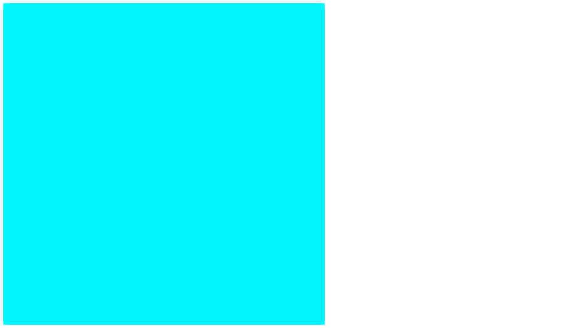

# GeometryTypes

[](https://travis-ci.org/JuliaGeometry/GeometryTypes.jl)
[](https://ci.appveyor.com/project/SimonDanisch/geometrytypes-jl/branch/master)
[](https://coveralls.io/r/JuliaGeometry/GeometryTypes.jl)

Geometry primitives and operations building up on FixedSizeArrays.

Some of the types offered by GeometryTypes visualized with [GLVisualize](https://github.com/JuliaGL/GLVisualize.jl):

```julia
HyperRectangle(Vec2f0(0), Vec2f0(100))
```



```julia
HyperRectangle(Vec3f0(0), Vec3f0(1))
HyperCube(Vec3f0(0), 1f0)
```


```julia
HyperSphere(Point2f0(100), 100f0)
```


```julia
HyperSphere(Point3f0(0), 1f0)
```


```julia
Pyramid(Point3f0(0), 1f0, 1f0)
```


```julia
load("cat.obj") # --> GLNormalMesh, via FileIO
```


## Displaying primitives

To display geometry primitives, they need to be decomposable.
This can be done for any arbitrary primitive, by overloading the following interface:

```julia
# Lets take SimpleRectangle as an example:
# Minimal set of decomposable attributes to build up a triangle mesh
isdecomposable{T<:Point, HR<:SimpleRectangle}(::Type{T}, ::Type{HR}) = true
isdecomposable{T<:Face, HR<:SimpleRectangle}(::Type{T}, ::Type{HR}) = true

# Example implementation of decompose for points
function decompose{PT}(P::Type{Point{3, PT}}, r::SimpleRectangle, resolution=(2,2))
    w,h = resolution
    vec(P[(x,y,0) for x=linspace(r.x, r.x+r.w, w), y=linspace(r.y, r.y+r.h, h)])
end

function decompose{T<:Face}(::Type{T}, r::SimpleRectangle, resolution=(2,2))
    w,h = resolution
    Idx = LinearIndices(resolution)
    faces = vec([Face{4, Int}(
            Idx[i, j], Idx[i+1, j],
            Idx[i+1, j+1], Idx[i, j+1]
        ) for i=1:(w-1), j=1:(h-1)]
    )
    decompose(T, faces)
end
```

With these methods defined, this constructor will magically work:

```julia
rect = SimpleRectangle(...)
mesh = GLNormalMesh(rect)
vertices(mesh) == decompose(Point3f0, rect)

faces(mesh) == decompose(GLTriangle, rect) # GLFace{3} == GLTriangle
normals(mesh) # automatically calculated from mesh
```

As you can see, the normals are automatically calculated only with the faces and points.
You can overwrite that behavior, by also defining decompose for the `Normal` type!
